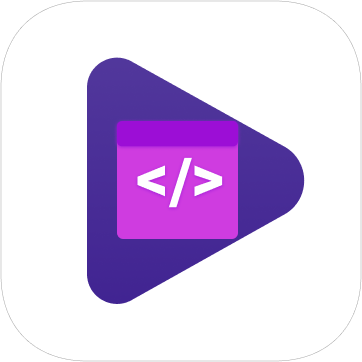

# Code Slides

<p align="center">
  
</p>
<p align="center">
<a href="https://marketplace.visualstudio.com/items?itemName=Craster.code-slides"></a>
<a href="https://github.com/CCraster/code-slides"></a>
<a href="https://github.com/CCraster/code-slides/blob/master/LICENSE"></a>

</p>

"Talk is cheap, show me your code!!!". Now, it's time to present your code as slides with `Code Slides`.

## What's new in Code Slides 0.1.1

- 🎉 Change projects file tree view in Side Bar will `update immediately`
- 🎉 `Select snippets first` and add slide with command in right click menu
- 🎉 Support `slide moving` in project

## Features

- 🔥 Capture code snippets and Highlight them
- 🎉 Organize multiple code snippets as Slides and store these slides as Project
- 🎆 Present multiple slides under the chosen project
- 🎨 Choose code snippets from different codebase and store them at the same project
- ⚡ Provide the Side Bar View to visualize, explore, and manage all slides and projects
- 🔧 A Status Bar which identifies the project current working on or project playing status
- 📺 Control presentation with [Keyboard Shortcuts](#keyboard-shortcuts) and freely switch among different slides

## Getting Started with Code Slides


1. Open `Code Slides` at vscode Side Bar.
2. Create project.
3. Add one slide into the project.
4. Choose a code snippet you want to highlight in a code file, and click the "Add Slide End" button at Side Bar or Toolbar, so that this code snippet can be saved in the current slide.
5. Click the play button named "Code Slides: Start Play Project" and start your presentation now!

## Configuration

Code Slides is configurable. Here's a list of settings you can change:

```json
{
  "code-slides.highlightMode": "Weaken Unhighliht Line",
  "code-slides.lineWeakenRenderOptions": {
    "opacity": "0.2"
  },
  "code-slides.lineStrengthenRenderOptions": {
    "backgroundColor": "rgba(255, 0, 0, 0.5)"
  },
  "code-slides.hideStatusBar": "false",
  "code-slides.statusBarNormalColor": "#fff",
  "code-slides.statusBarPlayingColor": "#0f0"
}
```

**`code-slides.highlightMode`:** The highlight mode in presentation. Can choose from 3 values: "Weaken Unhighlight Line", "Strengthen Highlight Line", "Both", and can used with "lineWeakenRenderOptions" and "lineStrengthenRenderOptions" together.

**`code-slides.lineWeakenRenderOptions`:** The [VSCode decoration render options](https://code.visualstudio.com/api/references/vscode-api#DecorationRenderOptions) for weaken.

**`code-slides.lineStrengthenRenderOptions`:** The [VSCode decoration render options](https://code.visualstudio.com/api/references/vscode-api#DecorationRenderOptions) for strengthen.

**`code-slides.hideStatusBar`:** Boolean value to hide the status bar(Not very recommended)

**`code-slides.statusBarNormalColor`:** The background color of the status bar when not playing slides. Can be any valid CSS color.

**`code-slides.statusBarPlayingColor`:** The background color of the status bar when playing slides. Can be any valid CSS color.

## Keyboard Shortcuts

| Name                             | Description                       | Windows Platform | MacOS Platform   |
| -------------------------------- | --------------------------------- | ---------------- | ---------------- |
| code-slides.addProject           | create a project                  | alt+ctrl+n       | option+cmd+n     |
| code-slides.addSlideStart        | add a slide under a project       | alt+ctrl+a       | option+cmd+a     |
| code-slides.playProjectFromStart | start presentation from a project | alt+ctrl+c       | option+cmd+c     |
| code-slides.stopPlayProject      | stop presentation from a project  | alt+ctrl+c       | option+cmd+c     |
| code-slides.showPreSlide         | switch to the previous slide      | alt+ctrl+left    | option+cmd+left  |
| code-slides.showNextSlide        | switch to the next slide          | alt+ctrl+right   | option+cmd+right |
